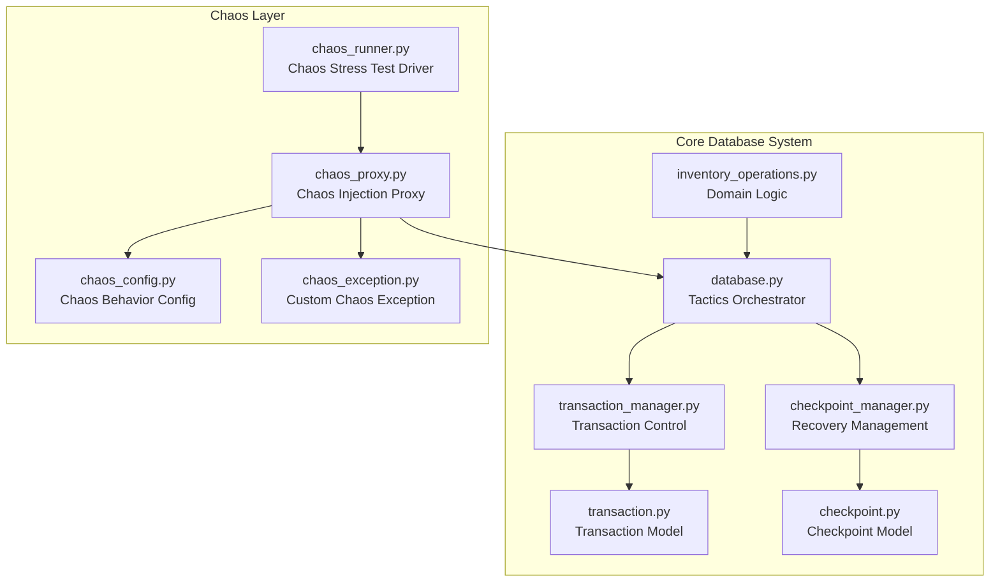
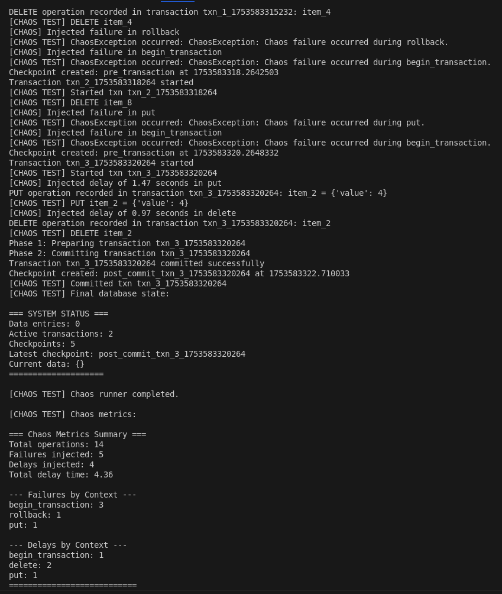

# 🗄️ ACID Rollback Database

A modular, thread-safe database showcasing **availability tactics** via ACID **transactions** for fault prevention and **rollback** mechanisms for fault recovery, ensuring high availability and data integrity.

---

## 🏗️ Software Architecture Foundation

This project implements two key availability tactics from software architecture patterns:

### 🔄 **Fault Recovery: Rollback Tactic**
*"A rollback permits the system to revert to a previous known good state upon the detection of a failure"*

- **Checkpoint Management**: Automatic snapshots at transaction boundaries and configurable intervals
- **Transaction-Level Rollback**: Reverts individual failed transactions to their starting state
- **System-Level Rollback**: Restores entire system to previous checkpoint ("rollback line")
- **State Preservation**: Deep-copy state preservation for clean recovery points

### 🛡️ **Fault Prevention: Transactions Tactic**
*"Systems targeting high-availability services leverage transactional semantics to ensure ACID properties"*

- **Two-Phase Commit Protocol**: Prevents race conditions through prepare and commit phases
- **ACID Compliance**: Atomic, consistent, isolated, durable operations with thread-safe concurrency control
- **Validation Gates**: Pre-commit validation to prevent invalid state transitions

### 🧪 **Chaos Testing & Fault Injection**  
*"Ensuring robustness through controlled fault simulation"*

- Implements a **Chaos Injection Proxy** that wraps the core database instance to intercept and inject chaos into key operations (`put`, `delete`, `begin_transaction`, `commit`, `rollback`).
- Using a **proxy pattern** allows chaos injection without modifying the original database code, preserving separation of concerns and making it easy to enable or disable chaos dynamically.
- The proxy introduces configurable **random failures** and **delays** based on set probabilities, simulating real-world faults such as network latency, unexpected errors, or resource contention.
- This approach enables comprehensive testing of the database’s **ACID guarantees** and rollback mechanisms under unpredictable conditions, helping to uncover subtle bugs and improve fault tolerance.
- Includes a **Chaos Runner** utility that automates stress testing by running randomized transactions with chaos injection, validating system stability over time.

## 📐 Architecture Overview

```
src/
├── models/
│   ├── checkpoint.py       # 📸 Checkpoint structures
│   └── transaction.py      # 🔄 ACID transaction models
├── checkpoint_manager.py   # 🎯 Recovery point management
├── transaction_manager.py  # ⚖️ Two-phase commit control
├── database.py            # 🎭 Tactics orchestrator
└── inventory_operations.py # 📦 Domain-specific logic
tests/                     # 🧪 Unit and integration tests
main.py                    # 🚀 Demo application
docs/                      # 📚 Additional guides
```

**🎯 Separation of Concerns:**
- `CheckpointManager` handles rollback logic
- `TransactionManager` enforces ACID semantics
- `Database` integrates both for fault tolerance
- `InventoryOperations` encapsulates business rules

**High Level Architecture Diagram**


**✅ Testable & Modular:** Each component can be independently verified under fault scenarios.

---

## 🚀 Quick Start

```python
from src.database import AcidRollbackDB

db = AcidRollbackDB(
    checkpoint_interval=10,  # checkpoint every 10 transactions
    max_checkpoints=50       # retain up to 50 recovery points
)

# Begin a transaction 🛒
txn = db.begin_transaction()

# Perform operations
db.put(txn, "MILK-2PCT-1GAL", {...})
db.put(txn, "BREAD-WHITE-LOAF", {...})

# Commit or rollback ✅❌
try:
    db.commit_transaction(txn)
except:
    db.rollback_transaction(txn)

# Inspect status 📊
db.print_status()
```

---

## 📋 Common Usage Patterns

### 🛍️ Safe Sale Processing
```python
txn = db.begin_transaction()
try:
    db.inventory.update_stock_level(txn, "MILK-2PCT-1GAL", -2, "sale")
    db.inventory.update_stock_level(txn, "BREAD-WHITE-LOAF", -1, "sale")
    db.commit_transaction(txn)
except Exception:
    db.rollback_transaction(txn)
```

### 🔧 System Recovery
```python
db.simulate_fault()             # auto-rollback to last checkpoint
db.rollback_to_checkpoint(0)    # rollback to opening baseline
```
---
### Chaos Testing & Fault Injection

A chaos proxy injection is included in this project to simulate random failures and delays in database operations. This helps validate the correctness of ACID transactions and rollback mechanisms under fault conditions.

**Chaos Features:**

- Configurable failure rate to randomly throw exceptions during operations like `put`, `delete`, `begin_transaction`, `commit`, and `rollback`.
- Configurable delay injection to simulate slow operations and timing variability.
- Realistic fault scenarios that test your system’s fault recovery and transactional integrity.
- Collects metrics on failures, delays, and total delay time to analyze system resilience.

**How to run Chaos Runner:**

```
python -m chaos.chaos_runner
```

**Example of Chaos Results**


This runs a stress loop of random transactions, injecting chaos per configured parameters, and printing logs and final database state.

---

## 📚 API Reference

- `begin_transaction() -> str` 🆔
- `put(txn_id, sku, data) -> bool` 📝
- `get(sku, txn_id=None) -> dict` 🔍
- `delete(txn_id, sku) -> bool` 🗑️
- `commit_transaction(txn_id) -> bool` ✅
- `rollback_transaction(txn_id) -> bool` ↩️
- `rollback_to_checkpoint(index=-1) -> bool` 🔄

**📦 Inventory Operations** via `db.inventory`:

- `update_stock_level(...)`, `reserve_inventory(...)`, `process_return(...)`, etc.

**📊 Status & Utilities:** `get_system_status()`, `print_status()`, `simulate_fault()`

---

## 🎯 Benefits & Applications

- **⚡ Fast Recovery:** Instant rollback to known good states without data reconstruction
- **🔒 Data Integrity:** ACID guarantees and robust checkpoint retention
- **🏃‍♂️ High Concurrency:** Thread-safe design for parallel operations
- **🌍 Real-World Use Cases:** Retail POS, e‑commerce order handling, supply chain management, audit testing

---

## 🔬 Advanced Examples

### 📋 Stock Validation & Sale Processing

```python
txn = db.begin_transaction()
try:
    # Pre-flight checks 🔍
    milk_check = db.inventory.check_stock_availability("MILK-2PCT-1GAL", 2)
    if not milk_check["available"]:
        raise ValueError(f"Insufficient stock: {milk_check['reason']}")
    
    # Process sale 💰
    db.inventory.update_stock_level(txn, "MILK-2PCT-1GAL", -2, "sale")
    db.commit_transaction(txn)
except Exception as e:
    db.rollback_transaction(txn)
```

### 🔄 Multi-Operation Scenarios

```python
# Online order reservation 🛒
txn = db.begin_transaction()
try:
    db.inventory.reserve_inventory(txn, "MILK-2PCT-1GAL", 3)
    db.inventory.reserve_inventory(txn, "BREAD-WHITE-LOAF", 2)
    db.commit_transaction(txn)
except Exception:
    db.rollback_transaction(txn)

# Inventory audit adjustment 📝
audit_txn = db.begin_transaction()
try:
    actual_count = 42  # Physical count 📊
    db.inventory.adjust_inventory(audit_txn, "MILK-2PCT-1GAL", actual_count, "audit")
    db.commit_transaction(audit_txn)
except Exception:
    db.rollback_transaction(audit_txn)

# Generate reports 📈
restock_report = db.inventory.generate_restock_report()
print(f"Low stock items: {restock_report['low_stock_count']}")
```

### 🔧 System Recovery Scenarios

```python
# Establish baseline 📍
opening_txn = db.begin_transaction()  # Auto-checkpoint

# Simulate crash and recovery ⚠️
db.simulate_fault()                   # Rollback to last checkpoint
db.rollback_to_checkpoint(0)          # Rollback to baseline

# Verify state 🔍
status = db.get_system_status()
print(f"Active transactions: {status['active_transactions']}")
```

---

## 🔍 Implementation Deep Dive

### 🏗️ Technical Architecture

- **🔧 Modular Design**: Separate managers for transactions, checkpoints, and data operations
- **🔒 Thread Safety**: RLock synchronization for concurrent access patterns
- **📝 Operation Logging**: Complete audit trail for precise rollback execution
- **⚙️ Configurable Policies**: Adjustable checkpoint intervals and retention limits

### 🔄 Fault Recovery Implementation

- **📸 Checkpoint Creation**: Automatic snapshots at configurable intervals
- **📋 Rollback Line Management**: Multiple recovery points with retention policies
- **🧹 Active Transaction Cleanup**: Automatic abortion of in-flight transactions during system rollback

### 🛡️ Fault Prevention Implementation

- **⚖️ Two-Phase Commit**: Separate prepare and commit phases prevent race conditions
- **⚡ ACID Properties**: Atomicity, consistency, isolation, durability through validation and persistence
- **🚫 Deadlock Prevention**: Ordered resource acquisition and timeout mechanisms

---

## Reference

Bass, L., Clements, P., & Kazman, R. (2021). *Software Architecture in Practice* (4th ed.). Pearson Technology Group. <https://akademos.vitalsource.com/books/9780136886020> 💾✨
